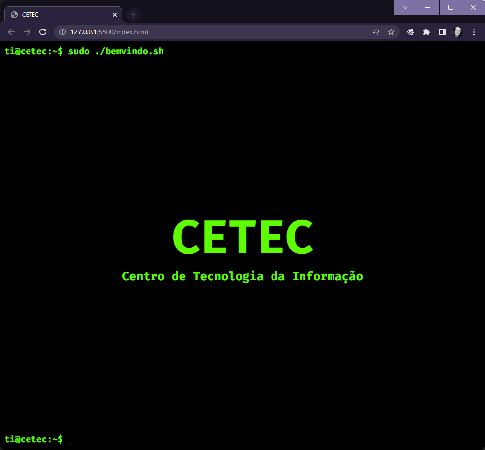

<h1 style="margin-bottom: 40px">CETEC</h1>

  
Logotipo CETEC, utilizando HTML e CSS

<a href="https://www.figma.com/file/spEDImAIKoKwPIVwiee4bw/CETEC?node-id=0%3A1&t=LEJ5CphCKMT92GQn-1">Projeto Figma</a>

  <h2 style="margin-top: 30px">🛠️ Tech Stack</h2>
  

  
Figma

  
VSCode

  
HTML

  
CSS

  <h2 style="margin-top: 30px">🔗 Github Pages</h2>
  

  <a href="https://raszanin.github.io/cetec/">CETEC - Github Pages</a>

  <h2 style="margin-top: 30px">👀 Preview</h2>
  

  

